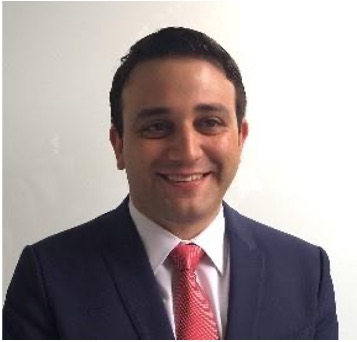

Wir sind Gerardo Salonia und Guillermo Cobián De Vinatea, zwei Professionals mit über 15 Jahren Berufserfahrung in Weltkonzernen, wie SAP, Arvato Bertelsmann, Santander Bank, Infosys und Accenture. Nach zwei sehr erfolgreichen Karrieren sieht das Team als nächster logischer Schritt der Einstieg in der Selbständigkeit durch den Unternehmenskauf

### Guillermo Cobián De Vinatea

* Geschäftsführer HOB Bauingenieurberatung in Peru (300 Mitarbeiter, 13 Millionen USD Umsatz)
* Berufserfahrung: 15+ Jahren
* Erfahrungsbereiche:

### Unser Werdegang
Wir kennen uns seit der Studienzeit an der Universität Mannheim. Wir haben als Team umfangreiche Erfahrung in der Unternehmensführung, im Management von großen und multidisziplinären Teams, in der Entwicklung und Implementierung neuer Geschäftsmodellen, in der Optimierung von Prozessen sowie in der Gewinnung und Steuerung von Großprojekten in B2B und B2G Bereich. Als Geschäftsführer bringt Guillermo wertvolles Praxis-Know-How in der Führung eines mittelständischen Unternehmens mit 300 Mitarbeiter und einen Umsatz von über 13 Mio. USD, in der Durchführung von Business Transformation Projekten sowie in der Digitalisierung von Unternehmen. In seiner Tätigkeit als Unternehmensberater, berät Gerardo Kunden in der Implementierung und Anwendung von Künstliche Intelligenz um Prozesse und Abläufe zu optimieren und zu automatisieren. Darüber hinaus hat Gerardo langjährige Erfahrung sowohl in der Mitarbeiterführung als auch in der Projektleitung von großen Teams (100 Mitarbeiter). Gerardo verfügt überumfangreiche Erfahrung in der Entwicklung von neuen Geschäften und in der Gewinnung von B2B Projekten in einstelligen Millionen Bereich.
